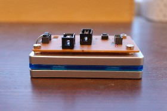

Pinoccio JTAG backpack
----------------------
This repository contains the schematic and board files for a converter
board to be mounted on top of the Atmel JTAGICE3 programmer, to allow
using bigger 2.54mm connector flatcables whenever possible and
reduce the chance of breaking the fragile 1.27mm connector flatcable.

This project is created using Kicad. The board design was intended as a
single-layer design, with the back layer emulated using wire bridges (so
the vias have a big drill size - be sure to double-check that if you
produce this as a proper double-layer design). There's also some other
caveats, for those and more background, see [this
blogpost](http://www.stderr.nl/Blog/Hardware/Electronics/JTAGICE3ConverterBoard.html).

License
-------
All content in this repository is licensed under the ["Beluki"
license][1]:

Permission is hereby granted, free of charge, to anyone obtaining a copy
of this document and accompanying files, to do whatever they want with
them without any restriction, including, but not limited to, copying,
modification and redistribution.

NO WARRANTY OF ANY KIND IS PROVIDED.

[1]: https://github.com/Beluki/License/blob/master/Documentation/License
